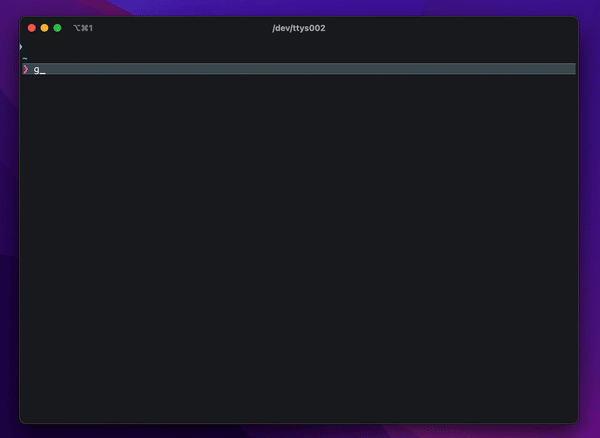

# Awesome MCP Clients 

A curated list of awesome Model Context Protocol (MCP) clients.

* [What is MCP?](#what-is-mcp)
* [Community](#community)
* [Clients](#clients)
* [Servers](#servers)

## What is MCP?

[MCP](https://modelcontextprotocol.io/) is an open protocol that enables AI models to securely interact with local and remote resources through standardized server implementations. This list focuses on production-ready and experimental MCP clients that extend AI capabilities through file access, database connections, API integrations, and other contextual services.

## Community

* [r/mcp Reddit](https://www.reddit.com/r/mcp)
* [Discord Server](https://glama.ai/mcp/discord)

## Clients

- [Awesome MCP Clients ](#awesome-mcp-clients-)
  - [What is MCP?](#what-is-mcp)
  - [Community](#community)
  - [Clients](#clients)
    - [5ire](#5ire)
    - [AIaW](#aiaw)
    - [Chainlit](#chainlit)
    - [ChatMCP](#chatmcp)
    - [Cherry Studio](#cherry-studio)
    - [Claude Desktop](#claude-desktop)
    - [ClaudeMind](#claudemind)
    - [Cline](#cline)
    - [console-chat-gpt](#console-chat-gpt)
    - [Copilot-MCP](#copilot-mcp)
    - [Cursor](#cursor)
    - [Continue](#continue)
    - [DeepChat](#deepchat)
    - [Dolphin-MCP](#dolphin-mcp)
    - [FLUJO](#flujo)
    - [Goose](#goose)
    - [http4k MCP Desktop](#http4k-mcp-desktop)
    - [HyperChat](#hyperchat)
    - [kibitz](#kibitz)
    - [LibreChat](#librechat)
    - [MCP Chatbot](#mcp-chatbot)
    - [MCP CLI client](#mcp-cli-client)
    - [MCP Simple Slackbot](#mcp-simple-slackbot)
    - [MCPOmni Connect](#mcpomni-connect)
    - [Nerve](#nerve)
    - [NextChat](#nextchat)
    - [oterm](#oterm)
    - [Superinterface](#superinterface)
    - [SeekChat](#seekchat)
    - [Tester MCP Client](#tester-mcp-client)
    - [Windsurf](#windsurf)
    - [Witsy](#witsy)
    - [Enconvo](#enconvo)
    - [y-cli](#y-cli)
    - [Zed](#zed)
    - [MindPal](#mindpal)
  - [Servers](#servers)

### 5ire

<table>
<tr><th align="left">GitHub</th><td>https://github.com/nanbingxyz/5ire</td></tr>
<tr><th align="left">Website</th><td>https://5ire.app/</td></tr>
<tr><th align="left">License</th><td>Modified Apache 2.0 (non-commercial)</td></tr>
<tr><th align="left">Type</th><td>Desktop app</td></tr>
<tr><th align="left">Platforms</th><td>Windows, MacOS, Linux</td></tr>
<tr><th align="left">Pricing</th><td>Free</td></tr>
<tr><th align="left">Programming Languages</th><td>TypeScript</td></tr>
</table>

5ire is a cross-platform desktop AI assistant, MCP client. It compatible with major service providers, supports local knowledge base and tools via model context protocol servers.

Screenshots

https://github.com/user-attachments/assets/a27494c5-437d-481c-a25f-74cfa5a2bc45

### AIaW

<table>
<tr><th align="left">GitHub</th><td>https://github.com/NitroRCr/AIaW</td></tr>
<tr><th align="left">Website</th><td>https://aiaw.app/</td></tr>
<tr><th align="left">License</th><td>BSD 3-Clause</td></tr>
<tr><th align="left">Type</th><td>Cross-platform app</td></tr>
<tr><th align="left">Platforms</th><td>Windows, MacOS, Linux, Android, Web</td></tr>
<tr><th align="left">Pricing</th><td>Free</td></tr>
<tr><th align="left">Programming Languages</th><td>Vue, TypeScript</td></tr>
</table>

AIaW is a cross-platform, full-featured and lightweight AI Chat client with full support for MCP.

Screenshots

### Chainlit

<table>
<tr><th align="left">GitHub</th><td>https://github.com/chainlit/chainlit</td></tr>
<tr><th align="left">Website</th><td>https://chainlit.io/</td></tr>
<tr><th align="left">License</th><td>Apache 2.0</td></tr>
<tr><th align="left">Type</th><td>Web app</td></tr>
<tr><th align="left">Platforms</th><td>Web</td></tr>
<tr><th align="left">Pricing</th><td>Free</td></tr>
<tr><th align="left">Programming Languages</th><td>Python</td></tr>
</table>

Chainlit is a python framework to build conversational AI apps with support for MCP.

Screenshots

### ChatMCP

<table>
<tr><th align="left">GitHub</th><td>https://github.com/daodao97/chatmcp</td></tr>
<tr><th align="left">Website</th><td>-</td></tr>
<tr><th align="left">License</th><td>Apache 2.0</td></tr>
<tr><th align="left">Type</th><td>Desktop app</td></tr>
<tr><th align="left">Platforms</th><td>Windows, MacOS, Linux</td></tr>
<tr><th align="left">Pricing</th><td>Free</td></tr>
<tr><th align="left">Programming Languages</th><td>Dart</td></tr>
</table>

ChatMCP is an AI chat client implementing the Model Context Protocol (MCP).

Screenshots

### Cherry Studio
<table>
<tr><th align="left">GitHub</th><td>https://github.com/CherryHQ/cherry-studio</td></tr>
<tr><th align="left">Website</th><td>https://cherry-ai.com</td></tr>
<tr><th align="left">License</th><td><a href="https://github.com/CherryHQ/cherry-studio/blob/main/LICENSE">Apache 2.0 + Addendum Terms*</a></td></tr>
<tr><th align="left">Type</th><td>Desktop app</td></tr>
<tr><th align="left">Platforms</th><td>Windows, MacOS, Linux</td></tr>
<tr><th align="left">Pricing</th><td>Free</td></tr>
<tr><th align="left">Programming Languages</th><td>TypeScript</td></tr>
</table>

**Cherry Studio** is a desktop client that supports for multiple LLM providers, available on Windows, Mac and Linux.

**Feature:**

- **Multi-Model Support**: Integrates cloud (OpenAI, Gemini, Anthropic), web AI (Claude, Perplexity), and local models (Ollama, LM Studio).
- **AI Assistants**: 300+ presets, custom creation, and multi-model parallel chats.
- **Doc Processing**: Handles text/images/Office/PDF, WebDAV, Mermaid, and code highlighting.
- **Productivity**: Global search, topic management, AI translation, drag-drop, mini-programs, and **MCP server**.
- **UX**: Cross-platform (Win/Mac/Linux), plug-and-play, light/dark themes, transparent UI, full Markdown, and easy sharing.

Screenshots

### Claude Desktop

<table>
<tr><th align="left">GitHub</th><td>-</td></tr>
<tr><th align="left">Website</th><td>https://claude.ai/download</td></tr>
<tr><th align="left">License</th><td>Proprietary</td></tr>
<tr><th align="left">Type</th><td>Desktop app</td></tr>
<tr><th align="left">Platforms</th><td>Windows, MacOS</td></tr>
<tr><th align="left">Pricing</th><td>Free</td></tr>
<tr><th align="left">Programming Languages</th><td>-</td></tr>
</table>

The Claude desktop app brings Claude's capabilities directly to your computer, allowing for seamless integration with your workflow.

Screenshots

### ClaudeMind

<table>
<tr><th align="left">GitHub</th><td>-</td></tr>
<tr><th align="left">Website</th><td>https://claudemind.com/</td></tr>
<tr><th align="left">License</th><td>Proprietary</td></tr>
<tr><th align="left">Type</th><td>Desktop app, JetBrains extension</td></tr>
<tr><th align="left">Platforms</th><td>Windows, MacOS</td></tr>
<tr><th align="left">Pricing</th><td>Per seat (from $29)</td></tr>
<tr><th align="left">Programming Languages</th><td>-</td></tr>
</table>

Experience Claude AI without limits. Use our desktop app for everyday AI assistance, or boost your coding productivity with our JetBrains plugin.

Screenshots

### Cline

<table>
<tr><th align="left">GitHub</th><td>https://github.com/cline/cline</td></tr>
<tr><th align="left">Website</th><td>https://marketplace.visualstudio.com/items?itemName=saoudrizwan.claude-dev</td></tr>
<tr><th align="left">License</th><td>Apache 2.0</td></tr>
<tr><th align="left">Type</th><td>VSCode extension</td></tr>
<tr><th align="left">Platforms</th><td>Windows, MacOS</td></tr>
<tr><th align="left">Pricing</th><td>Free</td></tr>
<tr><th align="left">Programming Languages</th><td>TypeScript</td></tr>
</table>

Cline can handle complex software development tasks step-by-step. With tools that let him create & edit files, explore large projects, use the browser, and execute terminal commands (after you grant permission), he can assist you in ways that go beyond code completion or tech support. Cline can even use the Model Context Protocol (MCP) to create new tools and extend his own capabilities. While autonomous AI scripts traditionally run in sandboxed environments, this extension provides a human-in-the-loop GUI to approve every file change and terminal command, providing a safe and accessible way to explore the potential of agentic AI.

Screenshots

### console-chat-gpt

<table>
<tr><th align="left">GitHub</th><td>https://github.com/amidabuddha/console-chat-gpt</td></tr>
<tr><th align="left">Website</th><td>-</td></tr>
<tr><th align="left">License</th><td>MIT</td></tr>
<tr><th align="left">Type</th><td>CLI</td></tr>
<tr><th align="left">Platforms</th><td>Windows, MacOS, Linux</td></tr>
<tr><th align="left">Pricing</th><td>Free</td></tr>
<tr><th align="left">Programming Languages</th><td>Python</td></tr>
</table>

Enjoy seamless interactions with ChatGPT, MistralAI, Claude by Anthropic, Grok by xAI, Gemini by Google and DeepSeek directly from your command line. Elevate your chat experience with efficiency and ease.

Screenshots

### Copilot-MCP

<table>
<tr><th align="left">GitHub</th><td>https://github.com/VikashLoomba/copilot-mcp</td></tr>
<tr><th align="left">Website</th><td>-</td></tr>
<tr><th align="left">License</th><td>GPL-v3</td></tr>
<tr><th align="left">Type</th><td>VSCode Extension</td></tr>
<tr><th align="left">Platforms</th><td>Windows, MacOS, Linux</td></tr>
<tr><th align="left">Pricing</th><td>Free</td></tr>
<tr><th align="left">Programming Languages</th><td>Any</td></tr>
</table>

VSCode extension that acts as a Model Context Protocol (MCP) client, enabling integration between MCP servers and GitHub Copilot Chat

Screenshots

### Cursor

<table>
<tr><th align="left">GitHub</th><td>https://github.com/getcursor/cursor</td></tr>
<tr><th align="left">Website</th><td>https://cursor.com</td></tr>
<tr><th align="left">License</th><td>Proprietary</td></tr>
<tr><th align="left">Type</th><td>Desktop app</td></tr>
<tr><th align="left">Platforms</th><td>Windows, MacOS, Linux</td></tr>
<tr><th align="left">Pricing</th><td>Freemium</td></tr>
<tr><th align="left">Programming Languages</th><td>TypeScript</td></tr>
</table>

Cursor is an AI-first code editor fork of VS Code that helps you code faster with built-in chat, edit, and debugging AI features. It supports MCP for enhanced AI capabilities and tool integration.

Screenshots

### Continue

<table>
<tr><th align="left">GitHub</th><td>https://github.com/continuedev/continue</td></tr>
<tr><th align="left">Website</th><td>https://continue.dev/</td></tr>
<tr><th align="left">License</th><td>Apache 2.0</td></tr>
<tr><th align="left">Type</th><td>VSCode extension, JetBrains extension</td></tr>
<tr><th align="left">Platforms</th><td>Windows, MacOS</td></tr>
<tr><th align="left">Pricing</th><td>Free</td></tr>
<tr><th align="left">Programming Languages</th><td>TypeScript</td></tr>
</table>

Continue is the leading open-source AI code assistant. You can connect any models and any context to build custom autocomplete and chat experiences inside VS Code and JetBrains.

Screenshots

### DeepChat

<table>
<tr><th align="left">GitHub</th><td>https://github.com/thinkinaixyz/deepchat</td></tr>
<tr><th align="left">Website</th><td>https://deepchat.thinkinai.xyz/</td></tr>
<tr><th align="left">License</th><td>Apache 2.0</td></tr>
<tr><th align="left">Type</th><td>Desktop app</td></tr>
<tr><th align="left">Platforms</th><td>Windows, MacOS, Linux</td></tr>
<tr><th align="left">Pricing</th><td>Free</td></tr>
<tr><th align="left">Programming Languages</th><td>TypeScript</td></tr>
</table>

DeepChat is a cross-platform desktop AI assistant, MCP client. DeepChat brings the power of AI to your desktop with privacy and efficiency, making it your ideal companion for productive work.

Screenshots

### Dolphin-MCP

<table>
<tr><th align="left">GitHub</th><td>https://github.com/cognitivecomputations/dolphin-mcp</td></tr>
<tr><th align="left">Website</th><td>-</td></tr>
<tr><th align="left">License</th><td>MIT</td></tr>
<tr><th align="left">Type</th><td>CLI, Python library</td></tr>
<tr><th align="left">Platforms</th><td>Linux, Windows, MacOS</td></tr>
<tr><th align="left">Pricing</th><td>Free</td></tr>
<tr><th align="left">Programming Languages</th><td>Python</td></tr>
</table>

**Dolphin-MCP** is an open-source multi-server bridging client for MCP. It allows you to connect any MCP-compatible server any LLM (local or remote), enabling flexible tool usage and resource access in real-time.

`pip install dolphin-mcp`

Screenshots

### FLUJO
<table>
<tr><th align="left">GitHub</th><td>https://github.com/mario-andreschak/FLUJO</td></tr>
<tr><th align="left">Website</th><td>flujo.orchestraight.co</td></tr>
<tr><th align="left">License</th><td>MIT</td></tr>
<tr><th align="left">Type</th><td>Next.js/Node Application</td></tr>
<tr><th align="left">Platforms</th><td>Linux, Windows, MacOS</td></tr>
<tr><th align="left">Pricing</th><td>Free</td></tr>
<tr><th align="left">Programming Languages</th><td>Typescript</td></tr>
</table>

Think n8n + ChatGPT. **FLUJO** is an desktop application that integrates with MCP to provide a workflow-builder interface for AI interactions. Built with Next.js and React, it supports both online and offline (ollama) models, it manages API Keys and environment variables centrally and can install MCP Servers from GitHub. FLUJO has an ChatCompletions endpoint and flows can be executed from other AI applications like Cline, Roo or Claude. 

- Environment & API Key Management
- Model Management
- MCP Server Integration
- Workflow Orchestration
- Chat Interface

  

Screenshots

### GitHub Copilot with VSCode Insight

<table>
<tr><th align="left">GitHub</th><td>https://github.com/github/copilot</td></tr>
<tr><th align="left">Website</th><td>https://github.com/features/copilot</td></tr>
<tr><th align="left">License</th><td>Proprietary</td></tr>
<tr><th align="left">Type</th><td>VSCode Extension</td></tr>
<tr><th align="left">Platforms</th><td>Windows, MacOS, Linux</td></tr>
<tr><th align="left">Pricing</th><td>Subscription-based</td></tr>
<tr><th align="left">Programming Languages</th><td>Any</td></tr>
</table>

GitHub Copilot with VSCode Insight now supports MCP server integration in agent mode. This enables developers to leverage MCP tools directly within their coding environment, enhancing productivity and enabling seamless AI-driven workflows.

**Preview Features:**
- **Agent Mode:** Use MCP server tools directly from GitHub Copilot in agent mode.
- **Enhanced AI Assistance:** Context-aware suggestions and tool integration.
- **Cross-Platform Support:** Available on Windows, MacOS, and Linux.

Screenshots

### Goose

<table>
<tr><th align="left">GitHub</th><td>https://github.com/block/goose</td></tr>
<tr><th align="left">Website</th><td>-</td></tr>
<tr><th align="left">License</th><td>Apache 2.0</td></tr>
<tr><th align="left">Type</th><td>AI Agent</td></tr>
<tr><th align="left">Platforms</th><td>MacOS, Linux</td></tr>
<tr><th align="left">Pricing</th><td>Free</td></tr>
<tr><th align="left">Programming Languages</th><td>Rust</td></tr>
</table>

Goose is a general-purpose AI agent that can dynamically plug into new extensions and learn how to use them. It solves higher-level problems using tools from multiple extensions and can interact with multiple extensions at once.

Screenshots

### http4k MCP Desktop

<table>
<tr><th align="left">GitHub</th><td>https://github.com/http4k/mcp-desktop</td></tr>
<tr><th align="left">Website</th><td>https://mcp.http4k.org</td></tr>
<tr><th align="left">License</th><td>Proprietary</td></tr>
<tr><th align="left">Type</th><td>StdIO -> Remote MCP proxy</td></tr>
<tr><th align="left">Platforms</th><td>MacOS, Windows, Linux</td></tr>
<tr><th align="left">Pricing</th><td>Per seat (see site). Free for non-commercial/non-profit/research</td></tr>
<tr><th align="left">Programming Languages</th><td>Native binary, written in Kotlin</td></tr>
</table>

The http4k MCP Desktop Client serves as a proxy that enables communication between desktop applications and MCP servers. While it works with any MCP-compliant server, it's specially optimized for servers built using the [http4k MCP SDK](https://mcp.http4k.org).

**Features**
- Multiple remote transport options: SSE (Server-Sent Events), JSON-RPC (stateless) and WebSocket.
- Various standard authentication methods: API Key, Bearer Token, Basic Auth, and OAuth
- Customizable reconnection logic

### HyperChat

<table>
<tr><th align="left">GitHub</th><td>https://github.com/BigSweetPotatoStudio/HyperChat</td></tr>
<tr><th align="left">Website</th><td>-</td></tr>
<tr><th align="left">License</th><td>Apache 2.0<a href="https://github.com/BigSweetPotatoStudio/HyperChat/blob/main/LICENSE">*</a></td></tr>
<tr><th align="left">Type</th><td>Desktop app</td></tr>
<tr><th align="left">Platforms</th><td>Windows, MacOS</td></tr>
<tr><th align="left">Pricing</th><td>Free</td></tr>
<tr><th align="left">Programming Languages</th><td>JavaScript</td></tr>
</table>

HyperChat is an open Chat client that can use various LLM APIs to provide the best Chat experience and implement productivity tools through the MCP protocol.

Screenshots

### kibitz

<table>
<tr><th align="left">GitHub</th><td>https://github.com/nick1udwig/kibitz</td></tr>
<tr><th align="left">Website</th><td>https://kibi.tz</td></tr>
<tr><th align="left">License</th><td>MIT</td></tr>
<tr><th align="left">Type</th><td>Mobile app, Desktop app</td></tr>
<tr><th align="left">Platforms</th><td>Mobile, Windows, MacOS, Linux</td></tr>
<tr><th align="left">Pricing</th><td>Free</td></tr>
<tr><th align="left">Programming Languages</th><td>TypeScript</td></tr>
</table>

kibitiz is the free and open-source Replit. Minimally, it is a lightweight chat interface to the popular LLM APIs (Anthropic and OpenAI API formats supported). Experience automated tool loops: try asking your agent to use [wcgw](https://github.com/rusiaaman/wcgw) to make a change to a local repository, then fix linter and compiler errors, make a commit, and push to remote, all without user intervention! Even better, code on-the-go by setting up MCP servers on your laptop, then connecting from your mobile through [Kinode](https://github.com/kinode-dao/kinode).

Screenshots

  
https://github.com/user-attachments/assets/3f8df448-1c81-4ff2-8598-c48283a4dc00

### LibreChat

<table>
<tr><th align="left">GitHub</th><td>https://github.com/danny-avila/LibreChat</td></tr>
<tr><th align="left">Website</th><td>https://www.librechat.ai/</td></tr>
<tr><th align="left">License</th><td>MIT license</td></tr>
<tr><th align="left">Type</th><td>Web app</td></tr>
<tr><th align="left">Platforms</th><td>-</td></tr>
<tr><th align="left">Pricing</th><td>Free</td></tr>
<tr><th align="left">Programming Languages</th><td>TypeScript</td></tr>
</table>

Enhanced ChatGPT Clone: Features Agents, Anthropic, AWS, OpenAI, Assistants API, Azure, Groq, o1, GPT-4o, Mistral, OpenRouter, Vertex AI, Gemini, Artifacts, AI model switching, message search, Code Interpreter, langchain, DALL-E-3, OpenAPI Actions, Functions, Secure Multi-User Auth, Presets, open-source for self-hosting.

Screenshots

### MCP Chatbot

<table>
<tr><th align="left">GitHub</th><td>https://github.com/3choff/mcp-chatbot</td></tr>
<tr><th align="left">Website</th><td>-</td></tr>
<tr><th align="left">License</th><td>MIT</td></tr>
<tr><th align="left">Type</th><td>CLI</td></tr>
<tr><th align="left">Platforms</th><td>Windows, MacOS, Linux</td></tr>
<tr><th align="left">Pricing</th><td>Free</td></tr>
<tr><th align="left">Programming Languages</th><td>Python</td></tr>
</table>

This chatbot example demonstrates how to integrate the Model Context Protocol (MCP) into a simple CLI chatbot. The implementation showcases MCP's flexibility by supporting multiple tools through MCP servers and is compatible with any LLM provider that follows OpenAI API standards.

### MCP CLI client

<table>
<tr><th align="left">GitHub</th><td>https://github.com/adhikasp/mcp-client-cli</td></tr>
<tr><th align="left">Website</th><td>-</td></tr>
<tr><th align="left">License</th><td>MIT</td></tr>
<tr><th align="left">Type</th><td>CLI</td></tr>
<tr><th align="left">Platforms</th><td>Windows, MacOS, Linux</td></tr>
<tr><th align="left">Pricing</th><td>Free</td></tr>
<tr><th align="left">Programming Languages</th><td>Python</td></tr>
</table>

A simple CLI to run LLM prompt and implement MCP client.

Screenshots

### MCP Simple Slackbot

<table>
<tr><th align="left">GitHub</th><td>https://github.com/sooperset/mcp-client-slackbot</td></tr>
<tr><th align="left">Website</th><td>-</td></tr>
<tr><th align="left">License</th><td>MIT</td></tr>
<tr><th align="left">Type</th><td>Slack Bot</td></tr>
<tr><th align="left">Platforms</th><td>Slack</td></tr>
<tr><th align="left">Pricing</th><td>Free</td></tr>
<tr><th align="left">Programming Languages</th><td>Python</td></tr>
</table>

A simple Slack bot that uses LLMs and the Model Context Protocol (MCP) tools.

Screenshots

### MCPOmni Connect

<table>
<tr><th align="left">GitHub</th><td>https://github.com/Abiorh001/mcp_omni_connect</td></tr>
<tr><th align="left">Website</th><td>-</td></tr>
<tr><th align="left">License</th><td>MIT</td></tr>
<tr><th align="left">Type</th><td>CLI</td></tr>
<tr><th align="left">Platforms</th><td>Linux</td></tr>
<tr><th align="left">Pricing</th><td>Free</td></tr>
<tr><th align="left">Programming Languages</th><td>Python</td></tr>
</table>

A powerful universal CLI client for MCP featuring stdio/SSE transport protocols, OpenAI model integration, dynamic prompt management with flexible argument formats (JSON/key-value), intelligent tool orchestration, and cross-server resource handling. Supports advanced features like context-aware execution, automatic tool selection, and real-time response handling.
`uv add mcpomni-connect` or `pip install mcpomni-connect`

Screenshots

### Nerve

<table>
<tr><th align="left">GitHub</th><td>https://github.com/evilsocket/nerve</td></tr>
<tr><th align="left">Website</th><td>https://github.com/evilsocket/nerve</td></tr>
<tr><th align="left">License</th><td>GPL3</td></tr>
<tr><th align="left">Type</th><td>CLI</td></tr>
<tr><th align="left">Platforms</th><td>Windows, MacOS, Linux</td></tr>
<tr><th align="left">Pricing</th><td>Free</td></tr>
<tr><th align="left">Programming Languages</th><td>Python</td></tr>
</table>

Nerve is an ADK ( Agent Development Kit ) and CLI designed to be a simple yet powerful platform for creating and executing LLM-based agents fully integrated with MCP.

Screenshots

### NextChat

<table>
<tr><th align="left">GitHub</th><td>https://github.com/ChatGPTNextWeb/NextChat</td></tr>
<tr><th align="left">Website</th><td>https://nextchat.club/</td></tr>
<tr><th align="left">License</th><td>MIT</td></tr>
<tr><th align="left">Type</th><td>Web app</td></tr>
<tr><th align="left">Platforms</th><td>Windows, MacOS, Linux</td></tr>
<tr><th align="left">Pricing</th><td>Free</td></tr>
<tr><th align="left">Programming Languages</th><td>TypeScript</td></tr>
</table>

NextChat: Light and Fast AI Assistant, with Claude, DeepSeek, GPT4, Gemini Pro & MCP support.

Screenshots

### oterm

<table>
<tr><th align="left">GitHub</th><td>https://github.com/ggozad/oterm</td></tr>
<tr><th align="left">Website</th><td>-</td></tr>
<tr><th align="left">License</th><td>MIT</td></tr>
<tr><th align="left">Type</th><td>CLI</td></tr>
<tr><th align="left">Platforms</th><td>Windows, MacOS, Linux</td></tr>
<tr><th align="left">Pricing</th><td>Free</td></tr>
<tr><th align="left">Programming Languages</th><td>Python</td></tr>
</table>

A terminal client for Ollama, with support for MCP servers.

Screenshots

### Superinterface

<table>
<tr><th align="left">GitHub</th><td>https://github.com/supercorp-ai/superinterface</td></tr>
<tr><th align="left">Website</th><td>https://superinterface.ai</td></tr>
<tr><th align="left">License</th><td>Proprietary</td></tr>
<tr><th align="left">Type</th><td>Web app</td></tr>
<tr><th align="left">Platforms</th><td>Web</td></tr>
<tr><th align="left">Pricing</th><td>Freemium</td></tr>
<tr><th align="left">Programming Languages</th><td>TypeScript</td></tr>
</table>

Superinterface is AI infrastructure and a developer platform to build in-app AI assistants with support for MCP, interactive components, client-side function calling and more.

Key features:

- Use tools from MCP servers in assistants embedded via React components or script tags
- SSE transport support
- Use any AI model from any AI provider (OpenAI, Anthropic, Ollama, others)

Screenshots

### SeekChat

<table>
<tr><th align="left">GitHub</th><td>https://github.com/seekrays/seekchat</td></tr>
<tr><th align="left">Website</th><td>https://seekrays.com/chat/</td></tr>
<tr><th align="left">License</th><td>Apache 2.0</td></tr>
<tr><th align="left">Type</th><td>Desktop app</td></tr>
<tr><th align="left">Platforms</th><td>Windows, MacOS</td></tr>
<tr><th align="left">Pricing</th><td>Free</td></tr>
<tr><th align="left">Programming Languages</th><td>Javascript</td></tr>
</table>

✨ A Sleek and Powerful AI Chat Desktop Application ✨

SeekChat supports MCP tool execution, enabling AI to directly control your computer and perform various tasks. Easily automate file management, data analysis, code development, and more, turning AI into a truly intelligent assistant.

Screenshots

### Tester MCP Client

<table>
<tr><th align="left">GitHub</th><td>https://github.com/apify/tester-mcp-client</td></tr>
<tr><th align="left">Website</th><td>https://apify.com/jiri.spilka/tester-mcp-client</td></tr>
<tr><th align="left">License</th><td>Apache 2.0</td></tr>
<tr><th align="left">Type</th><td>Web app</td></tr>
<tr><th align="left">Platforms</th><td>Web</td></tr>
<tr><th align="left">Pricing</th><td>Freemium</td></tr>
<tr><th align="left">Programming Languages</th><td>JavaScript</td></tr>
</table>

A client that connects to any MCP server using Server-Sent Events (SSE) and displays conversations in a chat-like UI.  
It is a standalone Apify Actor for testing MCP servers over SSE, with support for Authorization headers.  
Built with plain JavaScript (old-school style) and hosted on Apify, it requires no setup to run.  

Key features:

- Connects to any MCP server via Server-Sent Events (SSE).  
- Works with the [Apify MCP Server](https://apify.com/apify/actors-mcp-server) to interact with one or more Apify [Actors](https://apify.com/store).  
- Dynamically utilizes tools based on context and user queries (if supported by the server).  
- Open-source—review, suggest improvements, or modify as needed.

Screenshots

### Windsurf

<table>
<tr><th align="left">GitHub</th><td>N/A</td></tr>
<tr><th align="left">Website</th><td>https://codeium.com/windsurf</td></tr>
<tr><th align="left">License</th><td>Proprietary</td></tr>
<tr><th align="left">Type</th><td>Desktop app</td></tr>
<tr><th align="left">Platforms</th><td>Windows, MacOS, Linux</td></tr>
<tr><th align="left">Pricing</th><td>Freemium</td></tr>
<tr><th align="left">Programming Languages</th><td>TypeScript</td></tr>
</table>

The first agentic IDE, and then some. The Windsurf Editor is where the work of developers and AI truly flow together, allowing for a coding experience that feels like literal magic.

Screenshots

### Witsy

<table>
<tr><th align="left">GitHub</th><td>https://github.com/nbonamy/witsy</td></tr>
<tr><th align="left">Website</th><td>https://witsyai.com</td></tr>
<tr><th align="left">License</th><td>Apache 2.0</td></tr>
<tr><th align="left">Type</th><td>Desktop app</td></tr>
<tr><th align="left">Platforms</th><td>Windows, MacOS, Linux</td></tr>
<tr><th align="left">Pricing</th><td>Free</td></tr>
<tr><th align="left">Programming Languages</th><td>Typescript, Vue</td></tr>
</table>

Witsy is an AI desktop assistant supporting models from all major providers and one keyboard shortcut away!

Screenshots

### Enconvo

<table>
<tr><th align="left">GitHub</th><td>https://github.com/Enconvo</td></tr>
<tr><th align="left">Website</th><td>https://enconvo.com</td></tr>
<tr><th align="left">License</th><td>Proprietary</td></tr>
<tr><th align="left">Type</th><td>Desktop app</td></tr>
<tr><th align="left">Platforms</th><td> MacOS </td></tr>
<tr><th align="left">Pricing</th><td>Freemium</td></tr>
<tr><th align="left">Programming Languages</th><td>Typescript, Python , Swift</td></tr>
</table>

Enconvo is your AI Agent Launcher that revolutionizes productivity. With instant access, automate your daily tasks effortlessly. Our intelligent AI Agent system, powered by 150+ built-in tools and MCP support, learns and adapts to your workflow. Experience seamless automation and enhanced productivity with the most versatile AI assistant for macOS.

Screenshots

### y-cli

<table>
<tr><th align="left">GitHub</th><td>https://github.com/luohy15/y-cli</td></tr>
<tr><th align="left">Website</th><td>-</td></tr>
<tr><th align="left">License</th><td>MIT</td></tr>
<tr><th align="left">Type</th><td>CLI</td></tr>
<tr><th align="left">Platforms</th><td>Windows, MacOS, Linux</td></tr>
<tr><th align="left">Pricing</th><td>Free</td></tr>
<tr><th align="left">Programming Languages</th><td>Python</td></tr>
</table>

A tiny command-line interface chat application that brings AI conversations to your terminal. Features include chat data storage in JSONL files, interactive chat interface, support for multiple bot configurations compatible with OpenAI chat completion streaming format, Deepseek-r1 reasoning content support, and MCP client support with multiple server configurations.

Screenshots

### Zed

<table>
<tr><th align="left">GitHub</th><td>https://github.com/zed-industries/zed</td></tr>
<tr><th align="left">Website</th><td>https://zed.dev/</td></tr>
<tr><th align="left">License</th><td>GNU</td></tr>
<tr><th align="left">Type</th><td>Desktop app</td></tr>
<tr><th align="left">Platforms</th><td>Windows, MacOS, Linux</td></tr>
<tr><th align="left">Pricing</th><td>Free</td></tr>
<tr><th align="left">Programming Languages</th><td>Rust</td></tr>
</table>

Zed is a high-performance, multiplayer code editor from the creators of Atom and Tree-sitter.

Screenshots

https://github.com/user-attachments/assets/95624731-5469-4b58-a21f-bbb31d9838fa

### MindPal

<table>
<tr><th align="left">GitHub</th><td>https://github.com/mindpal-ai/mindpal</td></tr>
<tr><th align="left">Website</th><td>https://mindpal.io</td></tr>
<tr><th align="left">License</th><td>Proprietary</td></tr>
<tr><th align="left">Type</th><td>Web app</td></tr>
<tr><th align="left">Platforms</th><td>Web</td></tr>
<tr><th align="left">Pricing</th><td>Freemium</td></tr>
<tr><th align="left">Programming Languages</th><td>TypeScript</td></tr>
</table>

MindPal is a no-code platform for building and deploying AI agents and multi-agent workflows. It enables anyone without technical skills to create powerful AI automation solutions by connecting any AI model with any tool. Build complex workflows where multiple AI agents work together to accomplish tasks, with built-in support for MCP servers and tools.

Key features:
- No-code AI agent builder
- Multi-agent workflow orchestration
- Support for any AI model provider
- MCP server integration
- Visual workflow designer
- Built-in tool marketplace

Screenshots

## Servers

Looking for MCP servers? Check out the [awesome-mcp-servers](https://github.com/punkpeye/awesome-mcp-servers) repository.
